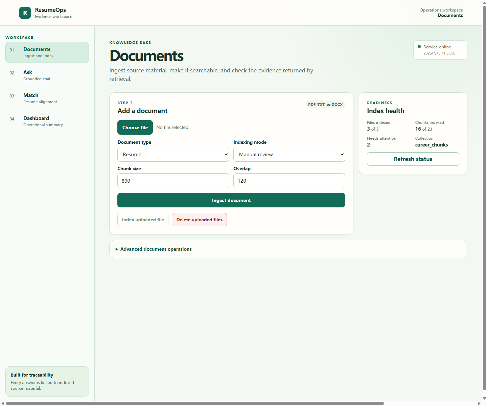
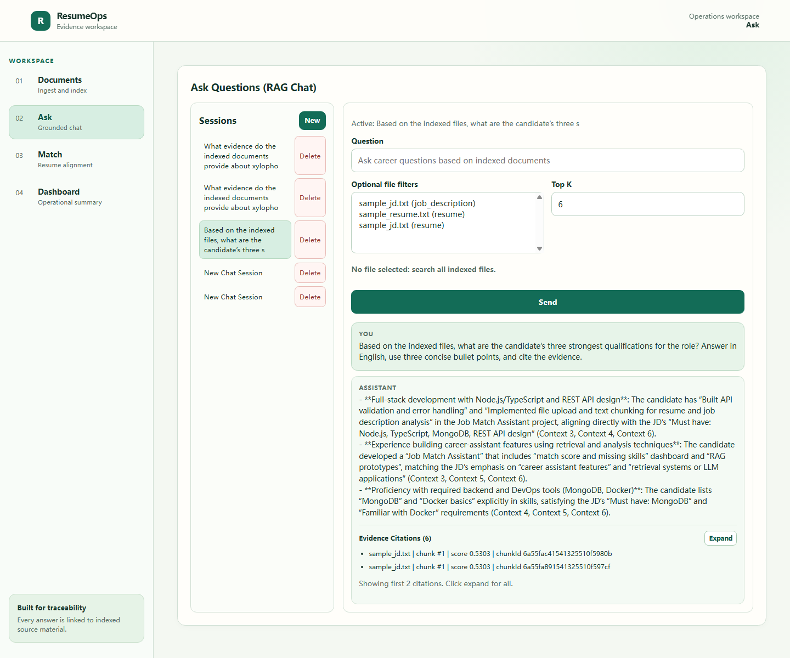
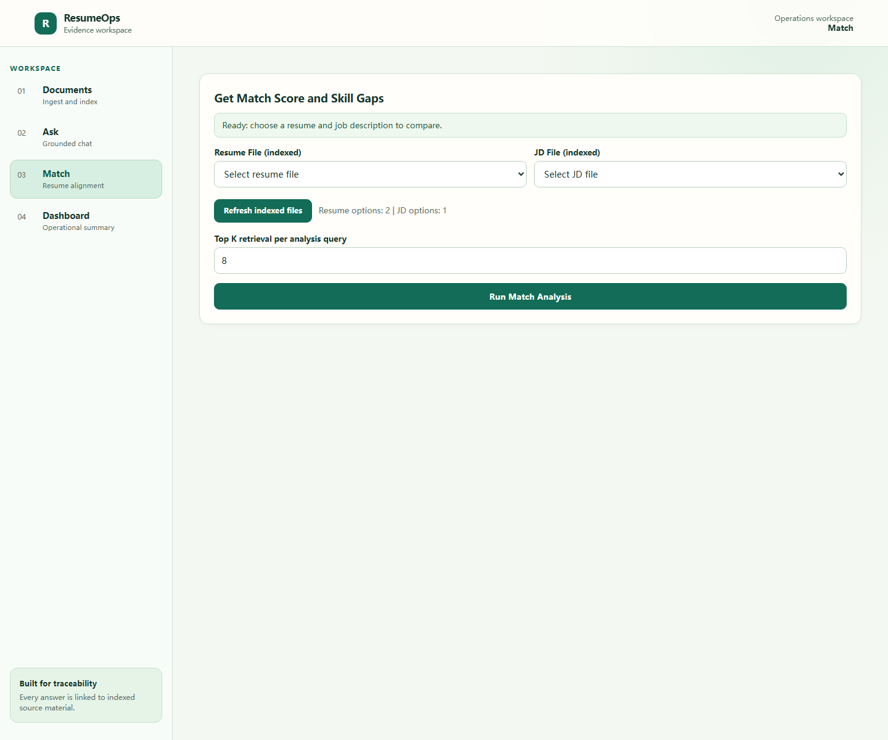
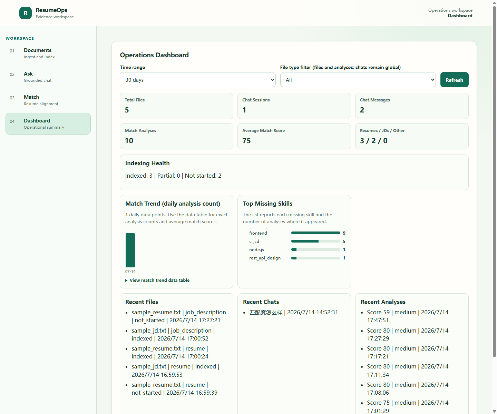

# RAG Career Assistant

An evidence-first workspace for ingesting resumes and job descriptions, retrieving grounded answers, and evaluating candidate alignment.

- Upload and index resume/JD files
- Ask grounded questions with source citations
- Run deterministic match analysis and skill-gap scoring
- Monitor document, indexing, and analysis health in one dashboard

## Demo

The product is organized as a four-workspace flow. Each screen below is captured from the running local application.

### 1) Documents

Ingest source material and control its indexing lifecycle.

- Upload `PDF`, `TXT`, or `DOCX` files
- Classify each upload as a resume, job description, or other supporting material
- Choose automatic indexing or a manual review flow
- Inspect collection/index health and use the retrieval debugger when needed



### 2) Ask

Create a chat session and ask questions against all indexed material or a selected group of files.

- File-scoped retrieval filters
- Grounded responses with source filename, chunk, and similarity-score citations
- Clear failed-response state with a safe retry path



### 3) Match

Choose one fully indexed resume and one fully indexed job description to run a deterministic comparison.

- Readiness checks prevent analysis on incomplete uploads
- Overall score and category breakdown
- Matched, missing, and weak skills with source evidence
- Evidence-backed recommendations
 


### 4) Dashboard

Review the local workspace's operational and analysis signals.

- Files, chat sessions/messages, analyses, and average match score
- Index health and daily match trend
- Top missing skills and recent files/chats/analyses
- Intentional file-type filtering for file and analysis data; chat metrics remain workspace-wide



## Tech Stack

- Frontend: React + Vite + TypeScript
- Backend: Node.js + Express + TypeScript
- App data: MongoDB
- Embeddings and chat: Qwen through DashScope
- Vector database: Qdrant (primary) or MongoDB vector retrieval

## Product Flow

1. **Documents** — upload files, choose indexing behavior, and verify retrieval readiness.
2. **Ask** — create a session, optionally narrow the source files, then inspect grounded citations.
3. **Match** — select an indexed resume and JD, then review deterministic skill-gap results.
4. **Dashboard** — monitor activity, indexing health, match trends, and missing skills.

## Local Setup

### 1) Prerequisites

- Node.js 20+
- npm
- Docker Desktop (recommended for MongoDB and Qdrant)
- A DashScope API key for Qwen-powered embeddings and chat

### 2) Start MongoDB and Qdrant

The backend needs **both** MongoDB and Qdrant. Start them in separate persistent containers:

```bash
docker run -d --name rag-career-mongodb -p 27017:27017 -v rag-career-mongodb-data:/data/db mongo:7
docker run -d --name rag-career-qdrant -p 6333:6333 -v rag-career-qdrant-data:/qdrant/storage qdrant/qdrant:latest
```

Verify both containers:

```bash
docker ps
```

Qdrant dashboard: `http://localhost:6333/dashboard`

On later Docker restarts, start the stopped containers again:

```bash
docker start rag-career-mongodb rag-career-qdrant
```

### 3) Configure the backend

Copy the environment template into the backend directory:

```powershell
Copy-Item .env.example backend\.env
```

Set `DASHSCOPE_API_KEY` in `backend/.env`. The following is the default local configuration:

```env
PORT=4000
CLIENT_ORIGIN=http://localhost:5173
MONGODB_URI=mongodb://127.0.0.1:27017/rag-career-assistant

EMBEDDING_PROVIDER=qwen
DASHSCOPE_API_KEY=your_dashscope_api_key
QWEN_EMBEDDING_MODEL=text-embedding-v3
QWEN_CHAT_MODEL=qwen-plus

VECTOR_DB_MODE=qdrant
QDRANT_URL=http://127.0.0.1:6333
QDRANT_COLLECTION=career_chunks
```

Without a valid DashScope key, the backend can start but Qwen-backed indexing and chat requests cannot complete.

### 4) Install and run

```bash
npm install
npm install --prefix backend
npm install --prefix frontend
```

Run both applications together:

```bash
npm run dev
```

Or run each process in its own terminal:

```bash
npm run dev --prefix backend
npm run dev --prefix frontend
```

Default local URLs:

- Frontend: `http://localhost:5173`
- Backend health: `http://localhost:4000/api/health`
- Qdrant dashboard: `http://localhost:6333/dashboard`

If port `5173` is already occupied, Vite chooses another available port. Use the URL printed in the frontend terminal.

## Current Features

### Upload and Ingestion

- PDF/TXT/DOCX upload
- Text extraction and chunking
- File and chunk metadata stored in MongoDB
- Automatic or manual indexing
- Index one file or all pending files
- Clear uploaded-file and vector-index reset controls for local demos

### Vector Retrieval

- Qwen or local embedding provider
- Qdrant or MongoDB vector retrieval mode
- Multi-file retrieval filters
- Real similarity scores and source metadata
- Retrieval debugger for inspecting the returned evidence

### RAG Chat and Citations

- Session-based chat
- Grounded citations with file, chunk, and score details
- Insufficient-evidence guardrail response
- Persistent terminal failure message when retrieval or generation fails
- Retry action and stale-request protection when switching sessions

### Match Analysis

Deterministic scoring uses a weighted rubric:

- Skill coverage: 50%
- Experience alignment: 20%
- Tool/technology depth: 20%
- Domain similarity: 10%

Analysis only runs when the selected resume and JD are fully indexed and their vector-chunk counts are complete. It returns the overall score, confidence, category breakdown, source-backed skills, and recommendations.

JD requirements are extracted with Qwen when configured and fall back to a deterministic keyword extractor if the model is unavailable or does not return valid structured data. The validated result is cached by JD content and schema version.

### Dashboard

- KPI summary and index health
- Match trend with an accessible data-table alternative
- Top missing skills and recent activity
- File-type filters consistently applied to file/index/analysis metrics

## API Quick Reference

### Health

- `GET /api/health`

### Ingestion

- `POST /api/ingest`
- `GET /api/ingest/files`
- `DELETE /api/ingest/files`

### Vectors

- `POST /api/vector/index/file/:fileId`
- `POST /api/vector/index/all`
- `DELETE /api/vector/index/all`
- `GET /api/vector/index/status`
- `POST /api/vector/retrieve`

Retrieval accepts either `fileId` (one file) or `fileIds` (multiple files).

### Chat

- `POST /api/chat/sessions`
- `GET /api/chat/sessions`
- `GET /api/chat/sessions/:sessionId/messages`
- `POST /api/chat/sessions/:sessionId/messages`

Example message payload:

```json
{
  "question": "How does this candidate match a backend intern role?",
  "topK": 6,
  "fileIds": ["resume_file_id", "jd_file_id"]
}
```

### Match Analysis

- `POST /api/analysis/match`
- `GET /api/analysis`

### Dashboard

- `GET /api/dashboard/summary?days=30&fileType=resume`
- `GET /api/dashboard/match-trend?days=30&fileType=resume`
- `GET /api/dashboard/skill-gaps?limit=10&fileType=resume`

## Build and Tests

Build all packages:

```bash
npm run build
```

Run backend tests:

```bash
npm run test --prefix backend
```

Run the complete local static check:

```bash
npm run typecheck
```

## Demo Checklist

- [ ] MongoDB and Qdrant containers are running
- [ ] `DASHSCOPE_API_KEY` is set in `backend/.env`
- [ ] Backend health endpoint returns `status: ok`
- [ ] Upload and manual/automatic indexing work
- [ ] Chat returns grounded citations
- [ ] Match analysis accepts only complete resume/JD indexes
- [ ] Dashboard reflects the current workspace activity

## Known Limitations

- No authentication or authorization yet; this is a local demo workspace.
- Delete/reset endpoints are intentionally powerful for local demos.
- Local embedding mode is useful for development but Qwen is the intended quality path.
- Charts are deliberately lightweight and always have a text/table interpretation where needed.
